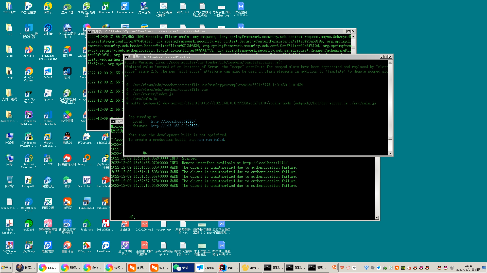
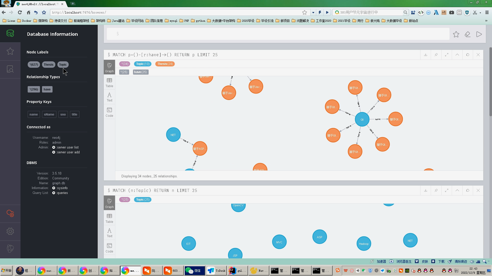
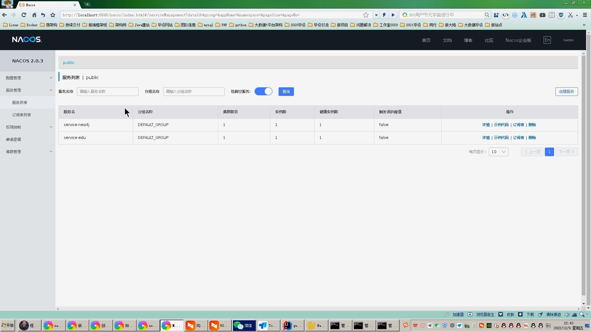
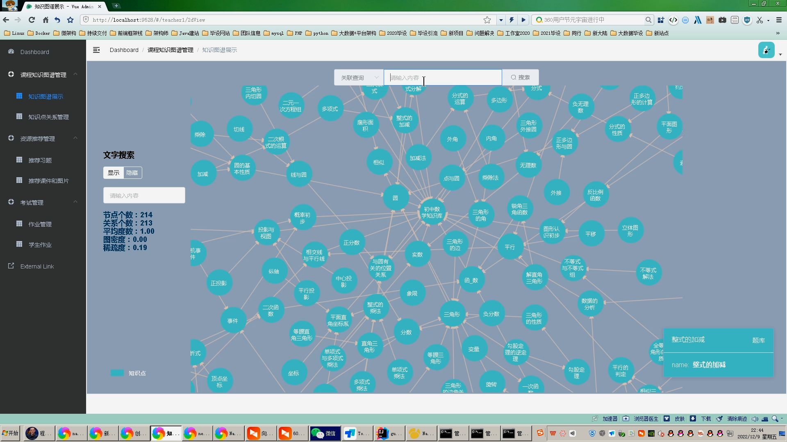
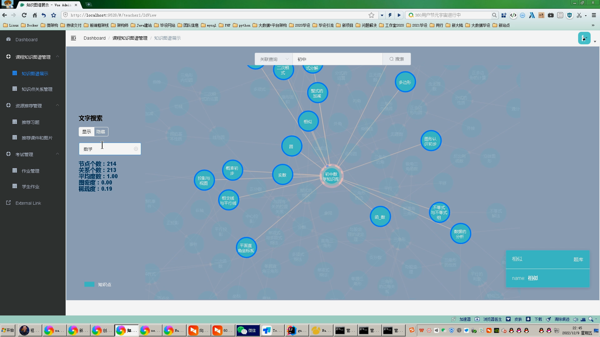
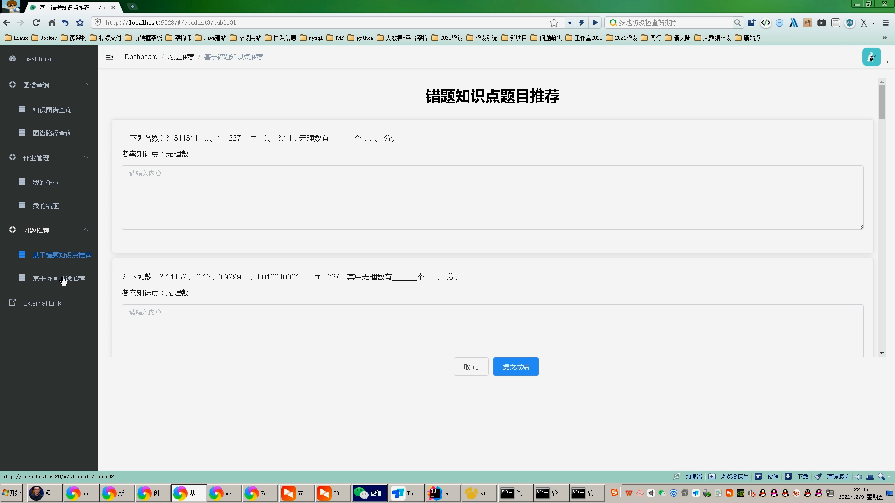
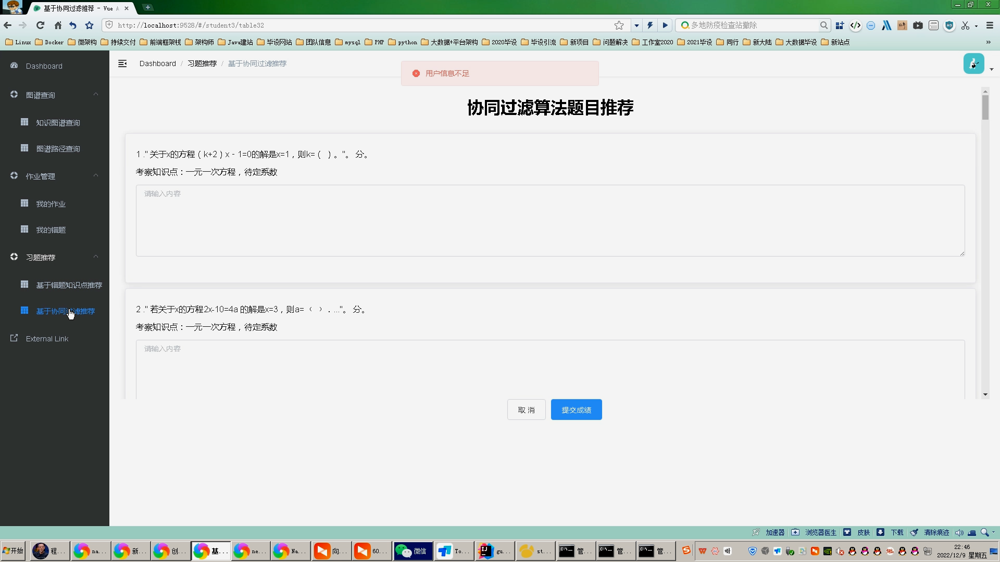
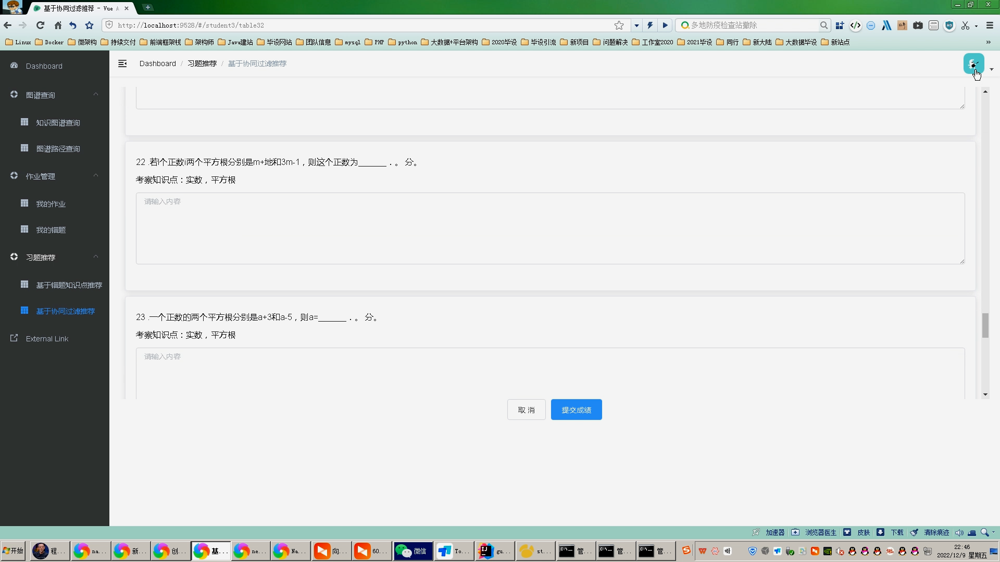

## 计算机毕业设计吊炸天SpringCloud+Neo4j知识图谱考试推荐系统 协同过滤算法 课程学习推荐系统 知识图谱推荐系统 大数据毕业设计 大数据毕设

## 要求
### 源码有偿！一套(论文 PPT 源码+sql脚本)

https://www.bilibili.com/video/BV1t84y1r7L6/?spm_id_from=333.999.0.0

### 

### 加好友前帮忙start一下，并备注github有偿获取源码
### 我的QQ号是2877135669 或者 1679232425
### 加qq好友说明（被部分 网友整得心力交瘁）：
    1.加好友务必按照格式备注
    2.避免浪费各自的时间！
    3.当“客服”不容易，repo 主是体面人，不爆粗，性格好，文明人。

## 开发技术
vue.js、springboot、mybaits、neo4j、MySQL、
协同过滤算法(基于用户+基于物品)

 

 

# 系统创新点

知识图谱

推荐算法

前后端分离

多角色登录

# 运行截图

# 运行视频(B站)

https://www.bilibili.com/video/BV1t84y1r7L6/?spm_id_from=333.999.0.0

